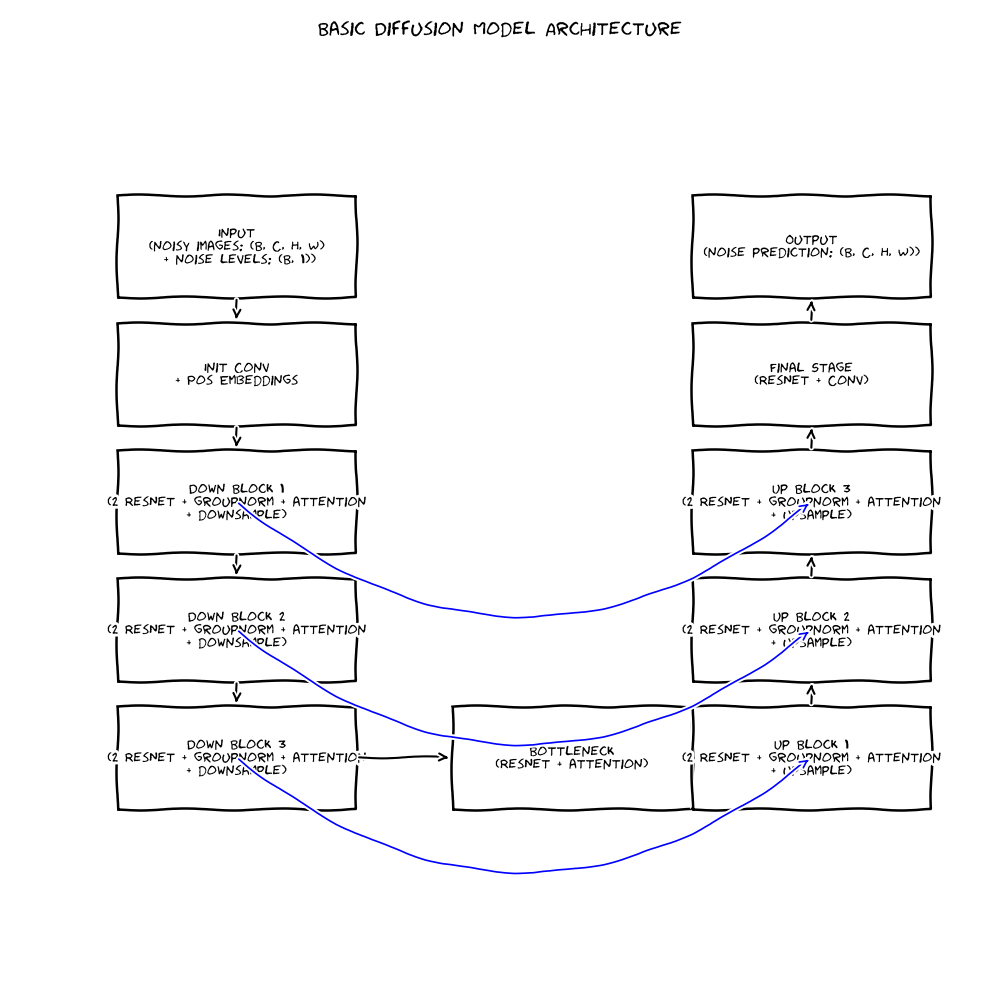

# **dgm_img_super_resolution**

A repository containing deep generative models for image super resolution. This repository is for the course project of STA410 (Statistical Computation) course taken at the University of Toronto.



## **Repository Structure**

```bash
├── srddpm
│   ├── __init__.py
│   ├── architecture.py
│   ├── data_preprocessing.py
│   ├── loss_func.py
│   ├── srddpm_notebook.ipynb
│   ├── low_res_cat.png
│   ├── training.py
│   ├── utils.py
├── notebooks
│   ├── basic_diffusion.ipynb
│   ├── vae.ipynb
│   ├── simple_gan.ipynb
│   ├── dcgan.ipynb
│   ├── wgan.ipynb
```


## **Introduction**

There are many deep generative models for image super resolution. The goal of this repo is not to build a model that outperforms the state of the art, but to build a model from scratch for educational purposes. We will focus on building a diffusion model for image super resolution, which we will call **SRDDPM**. 

<!-- - The directories contain modular and jupyter notebook implementations of deep generative models for image super resolution. 
    - The `srdiff` directory contains the code for an existing diffusion architecture meant for image super resolution - [SRDiff](https://arxiv.org/abs/2104.14951).
    - The `srgan` directory contains the code for an existing GAN architecture meant for image super resolution - [SRGAN](https://arxiv.org/abs/1609.04802).
    - The `srddpm` directory contains the code for a diffusion architecture meant for image super resolution - SRDDPM. As per my knowledge, this is not an existing architecture. I have created it by combining parts of SRGAN and SRDiff. However, this architecture has not been developed from the perspective of outperforming the state of the art. Rather, it is my attempt to better my understanding of how deep generative models can be used for image super resolution. I have not done any hyperparameter tuning or architecture tuning.   -->
- The `srddpm` directory contains the code for a diffusion architecture meant for image super resolution - SRDDPM. As per my knowledge, this is not an existing architecture. I have created it by combining parts of [SRGAN](https://arxiv.org/abs/1609.04802) and [SRDiff](https://arxiv.org/abs/2104.14951). However, this architecture has not been developed from the perspective of outperforming the state of the art. Rather, it is my attempt to better my understanding of how deep generative models can be used for image super resolution. I have not done any hyperparameter tuning or architecture tuning.
- The `notebooks` directory contains detailed explanations (along with the math) of some popular deep generative models like the Denoising Diffusion Probabilistic model (DDPM), Variational Autoencoder (VAE), and Generative Adversarial Networks (GANs). I highly recommend reading these notebooks to anybody who wants to get an intuitive understanding of these deep generative models. Note: these notebooks only contain the simplest version of the models. They are not meant to be used for image super resolution, but rather for educational purposes.

<!-- ## **SRDDPM Architecture**

You can run the SRDDPM architecture end-to-end using my [Kaggle notebook](https://www.kaggle.com/code/aryamanbansal/srddpm).

## **Dataset**

To train SRDDPM, I used the [DIV2K](https://data.vision.ee.ethz.ch/cvl/DIV2K/) dataset available on [Kaggle](https://www.kaggle.com/datasets/soumikrakshit/div2k-high-resolution-images). -->