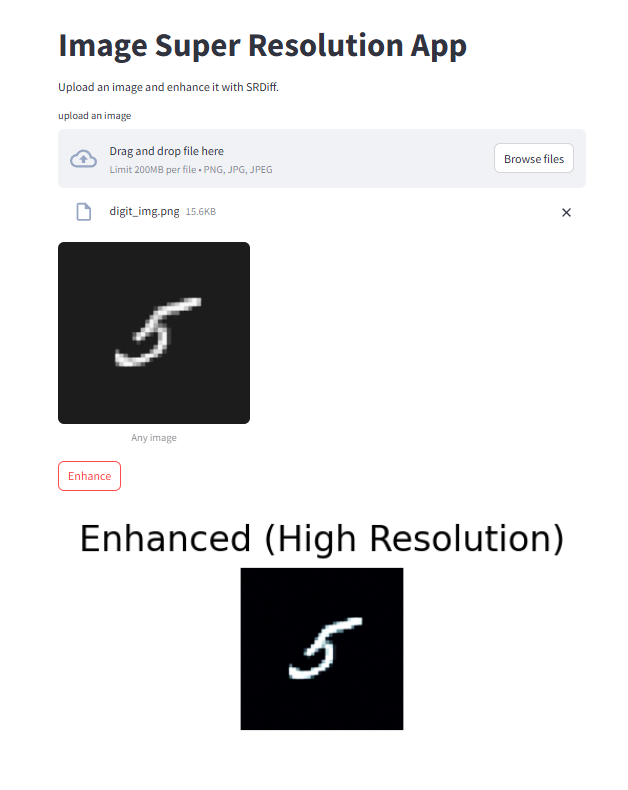

# **dgm_img_super_resolution**

A repository containing deep generative models for image super resolution. This repository is for the course project of STA410 (Statistical Computation) course taken at the University of Toronto.


## **Repository Structure**

```bash
├── srdiff
│   ├── config.yaml
│   ├── model_ckpt_steps_400000.ckpt
│   ├── model.py
│   ├── srdiff_notebook.ipynb
├── notebooks
│   ├── basic_diffusion.ipynb
│   ├── vae.ipynb
│   ├── simple_gan.ipynb
│   ├── dcgan.ipynb
│   ├── wgan.ipynb
├── basic_diffusion_model.png
|── README.md
|── car_img.png
|── cat_img.png
|── digit_img.png
|── flower_img.png
|── diffuser-stablediffusion-super-resolution.ipynb
|── st_app1.py
|── st_app2.py
|── st_demo1.png
|── st_demo2.png
```


## **Introduction**

There are many deep generative models for image super resolution. The goal of this repo is not to build a model that outperforms the state of the art, but to build fundamental deep generative models from scratch in PyTorch. Then use existing architectures built for image super resolution as pre-trained models, and do inference on them. This is because training a deep generative model from scratch is very compute expensive and generally does not give good results, until we have access to really good GPUs. Thus, we choose to use existing architectures as pre-trained models and do inference on them. This will allow us to see how these models work and will also make up for a good project. For the understanding part, the `notebooks` directory contains from-scratch implementations of fundamental deep generative models in PyTorch. These models are not meant to be used for image super resolution, but rather for educational purposes. 

I have tried 2 different diffusion-based architectures for image super resolution: 
- [SRDiff](https://arxiv.org/abs/2104.14951).
- [Stable Diffusion](https://huggingface.co/docs/diffusers/en/api/pipelines/stable_diffusion/upscale).

The SRDiff gives inferior results compared to the Stable Diffusion model. However, we can run it on CPU, while the Stable Diffusion model requires a GPU. 

I have deployed both models on Streamlit. The `st_app1.py` and `st_app2.py` files contain the code for the Streamlit app. You can run the app using the following command:

```bash
streamlit run st_app1.py
```
or 

```bash
streamlit run st_app2.py
```

These apps will allow you to upload an image and get the super-resolved image as output. Following images show the screenshots of the Streamlit app runnnig the SRDiff model:




Note: Unless you have a really good laptop, running the Streamlit apps will take some time (~ 15 seconds)...

- The `srdiff` directory contains the code for an existing diffusion architecture meant for image super resolution [SRDiff](https://arxiv.org/abs/2104.14951). 
- The `notebooks` directory contains detailed explanations (along with the math) of some popular deep generative models like the Denoising Diffusion Probabilistic model (DDPM), Variational Autoencoder (VAE), and Generative Adversarial Networks (GANs), implemented from scratch in PyTorch. I highly recommend reading these notebooks to anybody who wants to get an intuitive understanding of these deep generative models. Note: these notebooks only contain the simplest version of the models. They are not meant to be used for image super resolution, but rather for educational purposes.